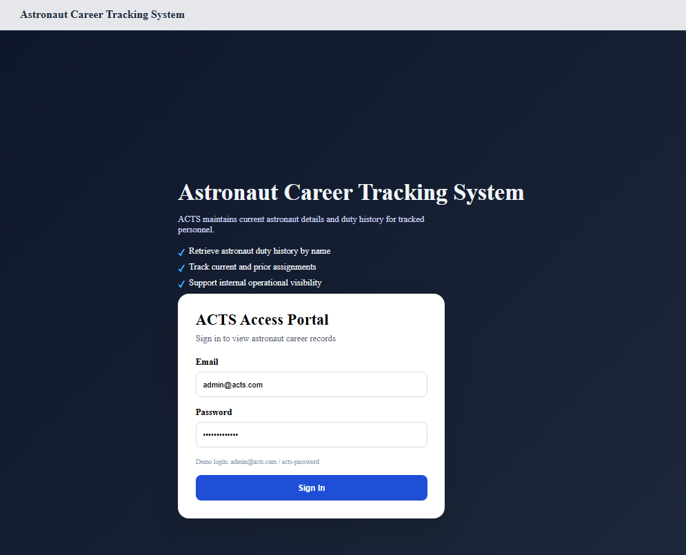
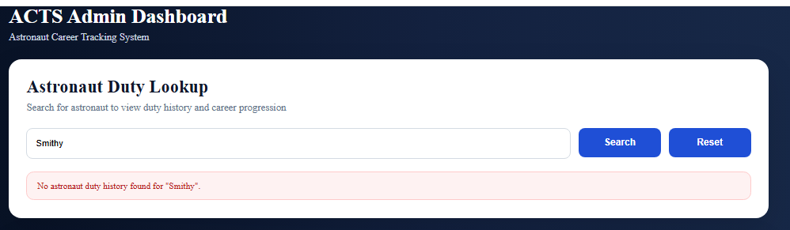
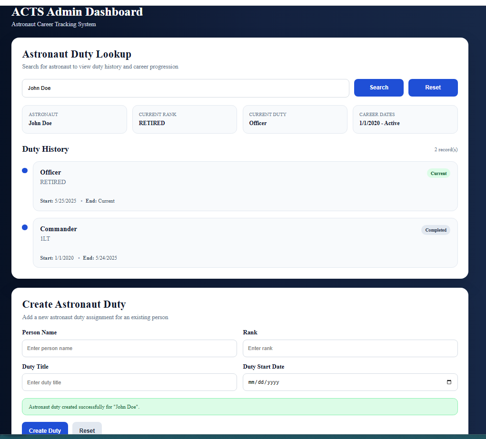
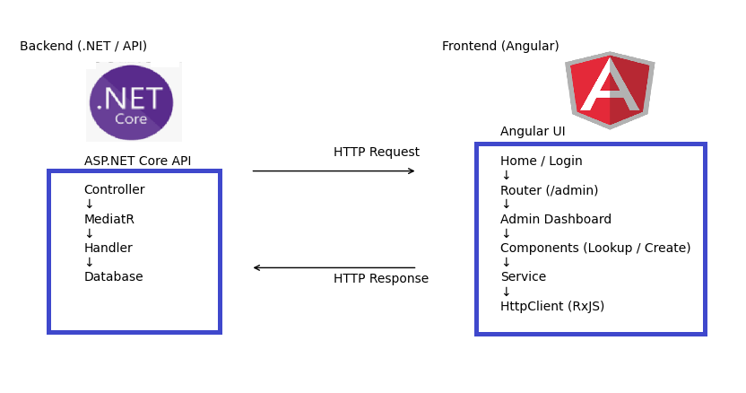

## Approach

- Reviewed the existing architecture (ASP.NET Core + MediatR)
- Identified gaps between implementation and stated requirements
- Prioritized backend implementation before UI
- Focused on maintainability, clarity, and alignment with requirements

## Improvements - API

### AstronautDutyController
- Updated GET action to send GetAstronautDutiesByName instead of GetPersonByName - done
- Added try/catch to CreateAstronautDuty for consistent exception handling - done

### GetAstronautDutiesByName & GetPersonByName
- Parameterized SQL queries to remove injection risk - done
- Added not-found handling for missing person - done

### CreatePerson.cs
- Requirement calls for add/update by name, but only create is supported - done
- BadHttpRequestException("Bad Request"); should be more descriptive 'Person already exists' and not generic - done

### Person Controller
- Improve request validation and error handling - done
- CreatePerson uses a raw string instead of a request model (limits validation) - done
- Added Update Person (PUT) and create new MediatR for separation of concerns - done

### CreateAstronautDutyPreProcessor
- Update BadHttpRequestExceptions to be more descriptive - done
- Miss-match with career end date being one day before retired duty start date. If RETIRED CareerEndDate not following rule. - done
- Updated verifyNoPreviousDuty preprocessor to validate duplicates per person (multiple astronauts can share the same duty title and date) - done

### Data.Person.cs
- Index Person.Name for query optimization  - done

### Process Logging
- Implemented database-backed logging via ProcessLog entity and table  - done
- Added IProcessLogService abstraction for centralized logging of business events  - done
- Logged successful operations in CreatePersonHandler  - done
- Logged exceptions in PersonController for failed requests  - done

### Unit Testing
- Added basic unit tests for CreatePerson to cover key validations and successful scenarios - done

## Future Improvements - API

### Person Controller
- Introduce centralized exception handling via middleware or MediatR pipeline behaviors  - to consider

### CreatePerson.cs
- No validation for Name is NULL or empty - todo

### CreateAstronautDutyPreProcessor
- Update queries to include parameterized queries to prevent SQL injection attack - todo

## Development - UI

- Created a Home landing page with a simple login experience to simulate user entry into the system - done

- Built an Admin Dashboard to serve as the primary working area for the application - done

- Implemented Astronaut Duty Lookup functionality: - done
  - Allows users to search for an astronaut by name
  - Displays duty history and career progression
  - Integrates with backend API using Angular services 

- Implemented Create Astronaut Duty feature: - done
  - Form-based input for Person Name, Rank, Duty Title, and Start Date
  - Connected to backend API to persist new duty records
  - Basic validation and reset functionality included

- Structured the UI using Angular component-based architecture:  - done
  - Separation of concerns between components, services, and templates
  - Reusable service layer for API communication

- Focused on clean layout and usability:  - done
  - Clear sectioning (Lookup vs Create) for a simple, readable UI with responsive form inputs

## Future Improvements - UI

1. Add proper authentication and authorization
   - Replace the simple login experience with secure token-based authentication
   - Introduce role-based access (e.g., admin vs standard user)

2. Add environment-based configuration
   - Move API base URLs into Angular environment files for local, development, and production builds
   - Prepare the application for environment-specific deployment

3. Expand routing as the application grows
   - Current routing supports Home and Admin Dashboard
   - Additional routes would support feature separation, route guards, and interceptor-based request handling

## UI Screenshots

### Admin Login

### Admin Dashboard - Search Error

### Admin Dashboard - Full View

*Admin Dashboard showing astronaut lookup and create duty functionality*

## Requst Flow Diagram

*The Angular UI follows a component → service → API pattern with clear separation of concerns.*

## Request Flow 

User  
→ Home Component (Login)  
→ Router Navigation (/admin)  
→ Admin Dashboard Component  
→ Astronaut Duty Components (Lookup / Create)  
→ AstronautDutyService  
→ HttpClient (Angular / RxJS)  
→ ASP.NET Core API (AstronautDutyController → MediatR → Handler)  
→ Database  

Response  
← Database  
← Handler  
← Controller  
← HttpClient  
← Service  
← Component  
← UI Updated
